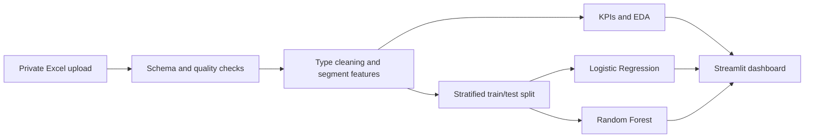

# European Bank Customer Segmentation & Churn Analytics

[](https://rahul-european-bank-churn-analytics.streamlit.app)
[](https://github.com/kamble-rahul/public-git-european-bank-churn-analytics/actions/workflows/ci.yml)
[](https://www.python.org/)

An end-to-end portfolio project for validating customer data, creating business-defined
segments, measuring churn patterns, comparing classification models, and presenting the
results in an interactive Streamlit dashboard.

**Live dashboard:** <https://rahul-european-bank-churn-analytics.streamlit.app>

> The customer-level workbook is deliberately excluded from GitHub. The application processes
> an uploaded `.xlsx` file in memory. The supplied file does not contain authoritative provenance
> proving that it came from the European Central Bank, so this project describes it as an
> educational European banking dataset.

## Business questions

1. What is the overall customer churn rate?
2. Which geographic, demographic, tenure, engagement, credit, and balance segments have the
   highest churn rate and churn contribution?
3. Is churn concentrated among high-balance customers?
4. How do an explainable Logistic Regression baseline and a nonlinear Random Forest compare?

## Product capabilities

- Validates schema, missing values, duplicates, numeric types, binary fields, and unusual ranges.
- Creates non-overlapping age, credit-score, tenure, balance, activity, and churn segments.
- Updates KPIs and charts from geography, gender, and age filters.
- Provides segment drill-down tables and CSV downloads.
- Explores geography × age interactions and high-value balance exposure.
- Compares Logistic Regression and Random Forest using ROC-AUC, PR-AUC, recall, precision,
  F1, accuracy, and a confusion matrix.
- Allows the Random Forest decision threshold to be adjusted for campaign capacity.

## Verified analytical highlights

Using the supplied 10,000-row workbook and the documented segment rules:

| Measure | Result |
|---|---:|
| Overall churn | 20.37% |
| Germany churn | 32.44% |
| France churn | 16.15% |
| Spain churn | 16.67% |
| Inactive/active churn-risk ratio | 1.88× |
| High-value threshold (75th percentile) | 127,644.24 |
| High-value churn | 23.68% |

These values are descriptive associations, not causal effects. `Balance at risk` is an exposure
proxy, not recognized revenue loss.

## Repository structure

```text
.
├── .github/                 # CI workflow, issue and pull-request templates
├── data/                    # Empty raw/interim/processed folders; data is gitignored
├── docs/                    # Architecture, dictionary, methodology, and model card
├── european_bank_churn/     # Reusable production Python package
│   ├── analytics.py         # KPI and segment calculations
│   ├── config.py            # Schema, band definitions, and model settings
│   ├── dashboard.py         # Streamlit page composition
│   ├── data.py              # Ingestion, validation, and feature engineering
│   ├── modeling.py          # Logistic Regression and Random Forest pipelines
│   └── visualization.py     # Plotly chart builders
├── models/                  # Local model artifacts; contents are gitignored
├── notebooks/               # Numbered exploration notebooks and guidance
├── reports/                 # Research paper, executive summary, and figures
├── tests/                   # Synthetic unit and integration tests
├── app.py                   # Thin Streamlit Cloud entrypoint
├── Makefile                 # Common local commands
├── pyproject.toml           # Package and quality-tool configuration
├── requirements.txt         # Streamlit/runtime dependencies
└── smoke_test.py            # End-to-end check against a local workbook
```

This structure is intentionally based on the separation encouraged by
[Cookiecutter Data Science](https://github.com/drivendataorg/cookiecutter-data-science), while
remaining small enough for a beginner to understand.

## Quick start

### 1. Clone and create an environment

```bash
git clone https://github.com/kamble-rahul/public-git-european-bank-churn-analytics.git
cd public-git-european-bank-churn-analytics
python3.11 -m venv .venv
source .venv/bin/activate
python -m pip install --upgrade pip
python -m pip install -r requirements.txt
```

Windows PowerShell activation:

```powershell
.venv\Scripts\Activate.ps1
```

### 2. Run the application

```bash
streamlit run app.py
```

Upload a workbook containing the columns in [the data dictionary](docs/data_dictionary.md).

### 3. Run quality checks

```bash
python -m pip install -r requirements-dev.txt
ruff check .
pytest --cov=european_bank_churn
```

To validate the real workbook locally without publishing it:

```bash
python smoke_test.py "/full/path/to/European_Bank (5).xlsx"
```

## Method summary



The required project is primarily segmentation and descriptive analytics. ML is a secondary
component used to rank churn risk, not a replacement for business KPI analysis.

## Documentation and deliverables

- [Architecture](docs/architecture.md)
- [Data dictionary](docs/data_dictionary.md)
- [Analytical methodology and KPI formulas](docs/methodology.md)
- [Model card and responsible-use limits](docs/model_card.md)
- [Research paper](reports/research_paper.md)
- [Executive summary for public-sector stakeholders](reports/executive_summary.md)
- [Notebook workflow](notebooks/README.md)
- [Contribution guide](CONTRIBUTING.md)
- [Security and data-reporting policy](SECURITY.md)

## Reproducibility and automation

- Segment thresholds and model settings are centralized in `config.py`.
- The split is stratified and controlled by `random_state=42`.
- Preprocessing and classifiers use scikit-learn `Pipeline` objects to reduce leakage risk.
- Tests use synthetic records and verify KPI denominators, boundaries, edge cases, and model output.
- GitHub Actions runs linting, tests, coverage, and compilation on Python 3.11 and 3.12.

## Responsible use

This is an educational decision-support project, not a production banking decision system.
Do not use its scores to deny services or make adverse decisions. Before operational use, obtain
data-owner approval and complete privacy, fairness, calibration, drift, security, and causal-impact
reviews. Gender and geography analysis must be interpreted as association and audited for fairness.

## License

No open-source license has been selected. Public visibility permits viewing and forking under
GitHub's terms, but it does not automatically grant broader reuse rights. The repository owner
should choose a license explicitly before inviting reuse or external contributions.
