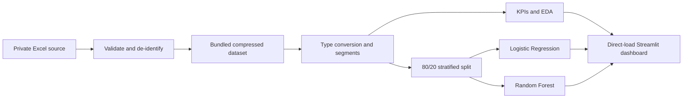

# Implementation Guide: European Bank Customer Churn Analytics

## 1. What this project builds

This project has three connected outputs:

1. A validated customer-level analytical dataset with clear business segments.
2. An exploratory data analysis (EDA) and two churn-classification models.
3. An interactive Streamlit application for filters, KPIs, charts, and drill-downs.

The main project requirement is descriptive segmentation and churn-pattern analysis. Machine
learning is an extension that ranks customer churn risk. It does not replace the KPI analysis.

## 2. Tools and technologies

| Tool | Purpose | Why it is used |
|---|---|---|
| Python 3.11 or 3.12 | Programming language | Stable versions supported by the project and Streamlit |
| PyCharm | Code editor and debugger | Convenient project interpreter, terminal, and test runner |
| pandas | Data loading and analysis | Reads Excel, cleans columns, groups customers, and calculates KPIs |
| NumPy | Segment conditions | Creates efficient balance and numeric conditions |
| openpyxl | Excel engine | Lets pandas read `.xlsx` files |
| Plotly | Interactive charts | Supports hover details and Streamlit integration |
| scikit-learn | Machine learning | Provides preprocessing, Logistic Regression, Random Forest, and metrics |
| Streamlit | Web application | Turns Python analytics into an interactive dashboard |
| pytest | Automated tests | Checks data rules, KPIs, models, and charts |
| Ruff | Code quality | Finds common Python errors and style problems |
| Git and GitHub | Version control and sharing | Tracks changes and publishes source code when the owner chooses |

No database or paid cloud service is required. The deployed application reads a bundled,
de-identified compressed dataset automatically.

## 3. Project structure

```text
.
├── app.py                         # Small Streamlit entrypoint
├── european_bank_churn/
│   ├── config.py                  # Columns, segment boundaries, and model settings
│   ├── data.py                    # Excel ingestion, validation, and feature engineering
│   ├── analytics.py               # KPI and grouped churn calculations
│   ├── modeling.py                # Logistic Regression and Random Forest pipelines
│   ├── visualization.py           # Plotly chart functions
│   └── dashboard.py               # Streamlit layout, filters, tabs, and downloads
├── scripts/
│   ├── build_dashboard_dataset.py # Creates the privacy-safe deployed data asset
│   └── generate_eda_report.py     # Rebuilds reports/eda_report.md from a workbook
├── notebooks/                     # Guided EDA notebook
├── reports/                       # EDA, research paper, and executive summary
├── docs/                          # Architecture, data dictionary, methods, and model card
├── tests/                         # Tests using synthetic data only
├── requirements.txt               # Runtime packages
├── requirements-dev.txt           # Test and lint packages
└── Makefile                       # Short commands for common tasks
```

Keeping data, analytics, model, visualization, and interface code separate makes each part easier to
learn, test, and change.

### Requirement traceability

| Project requirement | Implementation |
|---|---|
| Data ingestion and validation | `data.py`: Excel/CSV load, schema, missing, duplicate, binary, range, and category checks |
| Data cleaning and preparation | `data.py`: numeric conversion, category cleanup, invalid-target handling |
| Geography, age, credit, tenure, and balance segments | `config.py` definitions and `prepare_data` derived fields |
| Overall and segment churn | `overall_kpis` and `segment_summary` |
| Churn contribution | `segment_summary` with all churners as denominator |
| Churned versus retained profiles | `profile_comparison` |
| Gender and geography-age comparison | segment selection and geography-age heatmap |
| High-value churn and balance exposure | `high_value_summary` and high-value dashboard tab |
| Salary versus balance pattern | interactive salary-balance scatter plot |
| Overall churn KPI | Overview tab |
| Geographic risk index | Overview risk-index table |
| Engagement indicator | inactive-to-active churn-risk ratio |
| Segment filters and dynamic KPIs | sidebar filters applied before all descriptive calculations |
| Drill-down and downloads | segment summary and high-value customer CSV downloads |
| Research paper | `reports/research_paper.md` |
| EDA report | `reports/eda_report.md` and its generator script |
| Executive summary | `reports/executive_summary.md` |
| Direct-load Streamlit application | `app.py`, `dashboard.py`, and the standardized data asset |

## 4. Set up the project in PyCharm

### Step 1: Open the project

In PyCharm, select **File → Open** and choose the project folder containing `app.py`.

### Step 2: Create the Python environment

Open PyCharm's terminal in the project root and run:

```bash
python3.11 -m venv .venv
source .venv/bin/activate
python -m pip install --upgrade pip
python -m pip install -r requirements-dev.txt
```

On Windows PowerShell, activate with:

```powershell
.venv\Scripts\Activate.ps1
```

In **PyCharm → Settings → Project → Python Interpreter**, select the Python executable inside
`.venv`.

### Step 3: Understand the public-data boundary

The public application does not accept uploads. It uses
`data/processed/european_bank_dashboard.csv.gz`, which is derived from the authorized workbook.
During the build, original customer IDs become generated `DEMO-xxxxx` record IDs and surnames
become `Anonymous`. Analytical variables remain available so the dashboard results are unchanged.

The private workbook may be kept under `data/raw/` locally, where `.gitignore` prevents publication.
Do not commit the source workbook or hard-code a personal absolute path in application code.

## 5. Implementation flow



### Step 1: Build and load the standardized dataset

`scripts/build_dashboard_dataset.py` uses `pandas.read_excel` to read the first worksheet without
changing it. It validates the schema, replaces direct identifiers, and writes a compressed CSV.
`data.py` then loads that bundled asset automatically, and Streamlit caches it for the application
process. Visitors do not select or upload a file.

Maintainers can rebuild the asset from an authorized workbook with:

```bash
python scripts/build_dashboard_dataset.py "/full/path/to/European_Bank (5).xlsx"
```

### Step 2: Validate before analyzing

`validate_dataset` checks:

- all required columns are present;
- required values are missing or complete;
- `CustomerId` values are duplicated or unique;
- numeric fields contain valid numbers;
- `HasCrCard`, `IsActiveMember`, and `Exited` contain only 0 or 1;
- products, balances, ages, geographies, and genders contain plausible values;
- a constant `Year` field should be excluded from modeling.

Errors stop the application because calculating churn on invalid target values would be misleading.
Warnings remain visible for review.

### Step 3: Clean data and create segments

`prepare_data` converts numeric fields and trims category labels. It creates these non-overlapping
features:

| Segment | Rule |
|---|---|
| Age | `<30`, `30–45`, `46–59`, `60+` |
| Credit score | Low `<580`, Medium `580–669`, High `670+` |
| Tenure | New `0–2`, Mid-term `3–6`, Long-term `7–10` |
| Balance | Zero; low through median positive balance; high above that median |
| High value | Balance at or above a selected percentile; default is 75th |
| Activity | Active or inactive |
| Churn | Churned or retained |

The source requirement overlaps at age 60 (`46–60` and `60+`). This implementation uses `46–59`
and `60+`, so one customer cannot enter two age groups.

### Step 4: Calculate KPIs

`analytics.py` calculates every metric from customer counts, not from averages of percentages.

```text
Overall churn rate       = all churners / all customers
Segment churn rate       = segment churners / segment customers
Churn contribution       = segment churners / all churners
High-value churn ratio   = high-value churners / high-value customers
Geographic risk index    = geography churn rate / overall churn rate
Engagement risk ratio    = inactive churn rate / active churn rate
Balance at risk          = sum of balances for churned high-value customers
```

Balance at risk is an exposure proxy. It is not revenue, profit, or customer lifetime value.

### Step 5: Perform EDA

The EDA covers:

- overall churn and class balance;
- geography, age, gender, tenure, credit, balance, activity, product, and card segments;
- segment churn rate and contribution;
- geography-by-age interaction;
- retained versus churned customer profile;
- salary quartile and salary-versus-balance patterns;
- high-value customers and churned balance exposure;
- numeric correlation with `Exited`;
- model performance and feature importance.

Regenerate the complete report with:

```bash
python scripts/generate_eda_report.py "/full/path/to/European_Bank (5).xlsx"
```

The command writes `reports/eda_report.md`. It retrains the two demonstration models so the report
matches the selected workbook.

### Step 6: Prepare features for machine learning

The target is `Exited`. Model features are credit score, age, tenure, balance, product count,
credit-card ownership, activity, salary, geography, and gender.

The project deliberately excludes:

- `CustomerId`, because an identifier should not predict behavior;
- `Surname`, because it has no valid analytical role and can create privacy and overfitting risks;
- constant `Year`, because it contains no variation;
- derived segment labels, because the original numeric fields already contain their information.

The code creates an 80/20 stratified split. Stratification keeps a similar churn proportion in the
training and test sets. `random_state=42` makes the split reproducible.

### Step 7: Build preprocessing pipelines

For numeric features, the pipeline fills missing values with the median. Logistic Regression also
standardizes numeric scales. For category features, the pipeline fills missing values with the most
frequent value and applies one-hot encoding.

Preprocessing is fitted only on training data because it is inside the scikit-learn pipeline. This
reduces train-test leakage.

### Step 8: Train two models

**Logistic Regression** is the baseline. It is relatively simple and its coefficients make unusual
directions easier to investigate.

**Random Forest** is the main demonstration model. It combines many decision trees and can learn
nonlinear effects and interactions such as age, activity, geography, products, and balance working
together.

Both models use balanced class weights because churners are the minority class.

### Step 9: Evaluate correctly

| Metric | Meaning in this project |
|---|---|
| Recall | Share of actual churners found by the model |
| Precision | Share of flagged customers who actually churned |
| F1 | Balance between precision and recall |
| ROC-AUC | How well the model ranks churners above retained customers |
| PR-AUC | Ranking quality focused on the minority churn class |
| Accuracy | Share of all correct classifications; not sufficient by itself |
| Confusion matrix | Counts of correct and incorrect retained/churned predictions |

The dashboard lets the user change the Random Forest probability threshold. Lower thresholds often
find more churners but also flag more retained customers. A real threshold should use campaign
capacity and the business costs of missed churners and unnecessary contacts.

### Step 10: Build the Streamlit interface

`dashboard.py` provides five tabs:

1. **Overview**: customer count, churn, high-value churn, engagement risk, country chart, and
   geographic risk index.
2. **Segments**: selectable segment chart, KPI table, contribution, and CSV download.
3. **Geography & demographics**: age, tenure, geography-age heatmap, and profile comparison.
4. **High-value customers**: percentile control, balance exposure, country comparison,
   salary-balance plot, customer drill-down, and CSV download.
5. **ML model comparison**: model table, threshold control, confusion matrix, and feature
   importance.

Sidebar filters cover geography, gender, age, tenure, credit score, balance, activity, and product
count. Every KPI and chart recalculates on the filtered population.

### Step 11: Test the implementation

Run the complete quality suite:

```bash
python -m ruff check .
python -m pytest --cov=european_bank_churn
python -m compileall app.py european_bank_churn scripts tests
```

Run the end-to-end workbook check:

```bash
python smoke_test.py "/full/path/to/European_Bank (5).xlsx"
```

Tests use synthetic data so private customer rows are never placed in the repository.

### Step 12: Run the application

```bash
streamlit run app.py
```

Open the local address shown in the terminal, inspect the validation details, and review each tab.
The dashboard appears immediately without a file chooser. In PyCharm, the equivalent command is:

```bash
python -m streamlit run app.py
```

## 6. GitHub and Streamlit deployment

When publishing the project:

1. Extract the clean project ZIP.
2. Open the target GitHub repository and select **Add file → Upload files**.
3. Upload the project contents, including hidden `.github` and `.gitignore` files.
4. Do not upload `.venv`, `.idea`, `.git`, cache folders, the Excel workbook, ordinary CSV exports,
   or model files. Include only the approved compressed asset under `data/processed/`.
5. Confirm that `app.py`, `requirements.txt`, `README.md`, `european_bank_churn/`, `tests/`,
   `docs/`, `reports/`, `notebooks/`, and `.github/` are visible.
6. Use a clear commit message such as `Implement customer segmentation and churn analytics`.
7. After upload, check the repository file list and GitHub Actions results.

In Streamlit Community Cloud, select this repository, the `main` branch, and `app.py` as the
entrypoint. The application requires no secret and opens directly using its bundled standardized
dataset.

## 7. Common beginner mistakes

- Training before validating `Exited` and the schema.
- Calculating churn contribution with the wrong denominator.
- Allowing age 60 into two segment groups.
- Scaling or imputing the full dataset before splitting, which leaks test information.
- Using accuracy as the only metric for an imbalanced target.
- Treating Random Forest feature importance as proof of cause.
- Calling customer balance “revenue at risk.”
- Publishing source workbooks, original direct identifiers, or PyCharm virtual environments.
- Hard-coding a local file path inside `app.py`.

## 8. Recommended learning resources

### Python, pandas, and EDA

- Python tutorial: <https://docs.python.org/3/tutorial/>
- pandas getting-started guides: <https://pandas.pydata.org/docs/getting_started/index.html>
- pandas group-by guide: <https://pandas.pydata.org/docs/user_guide/groupby.html>

### Machine learning

- scikit-learn Logistic Regression guide:
  <https://scikit-learn.org/stable/modules/linear_model.html#logistic-regression>
- scikit-learn Random Forest guide:
  <https://scikit-learn.org/stable/modules/ensemble.html#forest>
- scikit-learn model-evaluation guide:
  <https://scikit-learn.org/stable/modules/model_evaluation.html>
- Video: StatQuest Logistic Regression: <https://www.youtube.com/watch?v=yIYKR4sgzI8>
- Video: StatQuest Random Forests: <https://www.youtube.com/watch?v=J4Wdy0Wc_xQ>

### Streamlit

- Streamlit getting-started guide: <https://docs.streamlit.io/get-started>
- Streamlit fundamentals: <https://docs.streamlit.io/get-started/fundamentals>
- Video: Streamlit 101: <https://www.youtube.com/watch?v=UI4f4iiVT6c>

Read the project files in this order while learning: `config.py`, `data.py`, `analytics.py`,
`visualization.py`, `modeling.py`, `dashboard.py`, and finally `app.py`.
